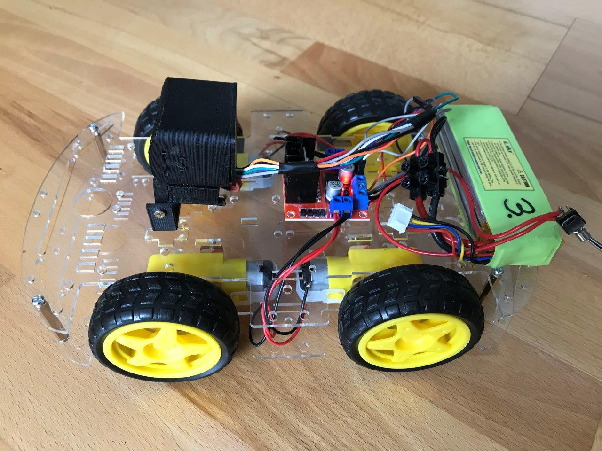
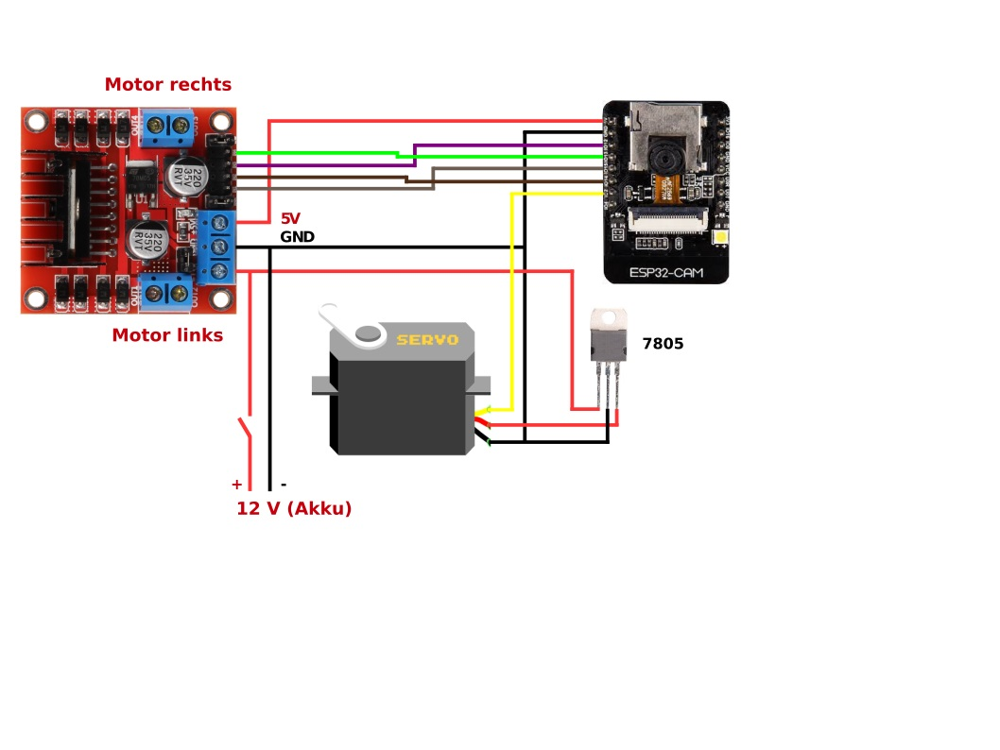
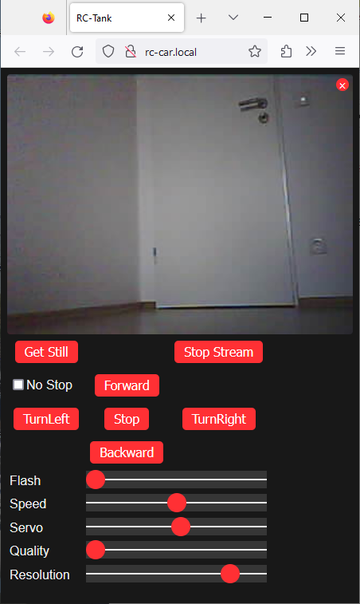

# ESP32CAM RC Car

This repository shows how to build a WLAN controlled RC Car with an ESP32CAM.
With a web interface you can control the car and the camera view is shown in the browser. 

It is possible to move the camera up and down with a small servo attached to the housing. Here is a small [Video](https://www.dropbox.com/s/yz9jac4miu72km5/IMG_2094.MOV?dl=0).

## Hardware
All necessary parts are listed below in the parts section with links to order. 
As chassis, I use the Joy-IT ROBOT CAR KIT 01. This is easy to mount. Just follow the assembling instructions. The two motors left and right are connected in [parallel](Motor.jpg). Make sure that they move in the same direction when powered.

As motor driver the L298N is used. The left/right motor is the connected to the two outputs on the motor driver. Make sure that direction is right for forward/backwards for both sides. If necessary change the cable connection. 

The motor driver is also providing the 5 Volt for the ESP32CAM. Ther power supply for the servo is done with an extra 7805 voltage regulator. This was necessary due to stability problems if ESP and Servo is supplied directly from the motor driver.

The ESP32CAM is located in a 3D printed housing. The files are available on [Thingiverse](https://www.thingiverse.com/thing:3579507). For mounting the housing to chassis you can either use the round bottom plate from Thingiverse or you can use my [mount](https://github.com/AK-Homberger/ESP32CAM_RC-CAR/blob/master/ESP32Cam-Mount.stl) instead. The servo arm has to be connected with bottom part with [metal wire](Servo.JPG). For the lenght of the connection wire you have to try a bit. For me, 20 mm worked well.

The 9g Micro Servo have to be placed and screwed into the 3D housing.

The components have to be connected as shown in the diagram. As battery you can use anything between 7.4 to 11.1 Volt. I'm using a 11.1 Volt lithium polymer accu from a RC helicopter.

## Software
The RC Car  is prepared for the Arduino IDE. To install the sketch, download the whole repository and then open the file "ESP32CAM-RC-Car.ino" in the IDE. Then edit the code to adjust the WLAN credentials according to your local needs. That's it. As board please select the "ESP32 Wrover Module" in the Arduino IDE. And please make sure you have the ESP32 board URL provided in the preferences (https://raw.githubusercontent.com/espressif/arduino-esp32/gh-pages/package_esp32_index.json).

You need an external (FTDI) programmer to install the (initial) sketch on the ESP32-CAM module. You have to set the voltage of the adapter to 5 Volt.

For programming you have to connect IO0 to GND, RX/TX (crossed) and 5V/GND. If you have the power supply already connected, then do not connect the 5V cable from the adapter. Then press the "RST" button on the ESP32-CAM. After that, you can start the upload process within the Arduino IDE (with FTDI USB-Serial port selected). For normal start open IO0 from GND and press "RST" again. 

After initial programming you can du uploads via OTA. Device name is "RC-Car".

## Web Control
The RC car can be controlled with a small web interface. Just power the car. The ESPCAM LED is flashing 5 times.

If your client is supporting MDNS the you can simly enter "rd-car.local" in the address field. Otherwise you have to provide the IP-Address (shown in Serial Monitor after programming).

To start the stream, just pess the "Start Stream" button. You can move forwards/backwards and left/right. With "Flash" you can set the power of the internal LED. With "Speed" you can adjust the speed of the car. With "Servo" you can move the camera view up and down. With "Quality/Resolution" you can define the camera settings for both options. With "Get Still" you can take a picture.

## ESP32CAM pinout

# Parts
- ESP32-CAM [Link](https://www.reichelt.de/entwicklerboards-esp32-kamera-2mp-25--debo-cam-esp32-p266036.html?&nbc=1)
- Car Kit [Link](https://www.reichelt.de/roboter-fahrgestell-kit-fuer-alle-arduino-systeme-robot-car-kit-01-p219024.html?&nbc=1)
- Motor Driver [Link](https://www.reichelt.de/entwicklerboards-motodriver2-l298n-debo-motodriver2-p202829.html?&nbc=1)
- Servo [Link](https://www.reichelt.de/servo-high-end-micro-analog-jamara-033212-p238316.html?&nbc=1)
- 7805 [Link](https://www.reichelt.de/festspannungsregler-5-v-1-5-a-to-220-3-ua-7805-ckcs-p189073.html?&nbc=1)
- Switch [Link](https://www.reichelt.de/miniatur-kippschalter-ein-aus-ein-3-a-250-v-goobay-10022-p285989.html?&nbc=1)
- Akku [Link](https://www.reichelt.de/akku-pack-li-polymer-7-4-v-900-mah-rd-xt-900-s2-p336955.html?&nbc=1)
- USB to Serial Adapter [Link1](https://www.reichelt.de/entwicklerboards-microusb-buchse-auf-uart-ft232-debo-musb2uart-3-p266053.html?&nbc=1) or [Link2](https://www.amazon.de/dp/B07R17BMTL/ref=sspa_dk_detail_2?psc=1&pd_rd_i=B07R17BMTL&pd_rd_w=ctPSK&pf_rd_p=4060291c-d237-411a-a3fe-4e44df687a4d&pd_rd_wg=enKhZ&pf_rd_r=B02DJZMKW4QRHKBN627Q&pd_rd_r=829304f2-0444-4fec-88dc-e2af9109243b&spLa=ZW5jcnlwdGVkUXVhbGlmaWVyPUExRVI5V0dQMjFTMjg2JmVuY3J5cHRlZElkPUEwOTIzOTg1MUhUSVNEQ1M2T0lSVSZlbmNyeXB0ZWRBZElkPUEwNTM1MjQ4SldZRlhJQlI0UzNVJndpZGdldE5hbWU9c3BfZGV0YWlsJmFjdGlvbj1jbGlja1JlZGlyZWN0JmRvTm90TG9nQ2xpY2s9dHJ1ZQ==)
- 3D Print Camera Mount [Link](https://www.thingiverse.com/thing:3579507)
