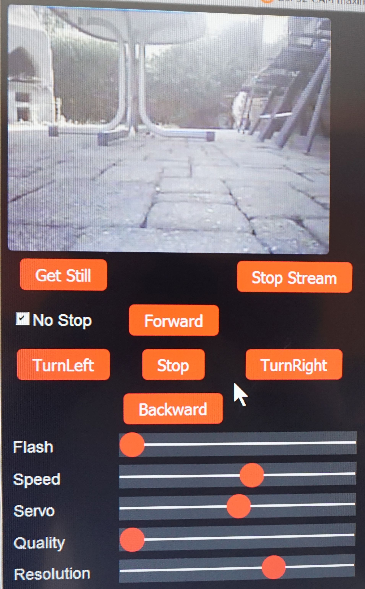

# ESP32CAM_RC-CAR

This repository shows how to build a WLAN controlled RC Car with an ESP32CAM.

Wiring:

For the $2 motor dirver search "L298N Motor Driver".

Control:

ESP32CAM pinout:

If you experience streaming problems or low wifi range try anther xclk frequency like 16mhz.

Line: config.xclk_freq_hz = 16000000; 

Video:

